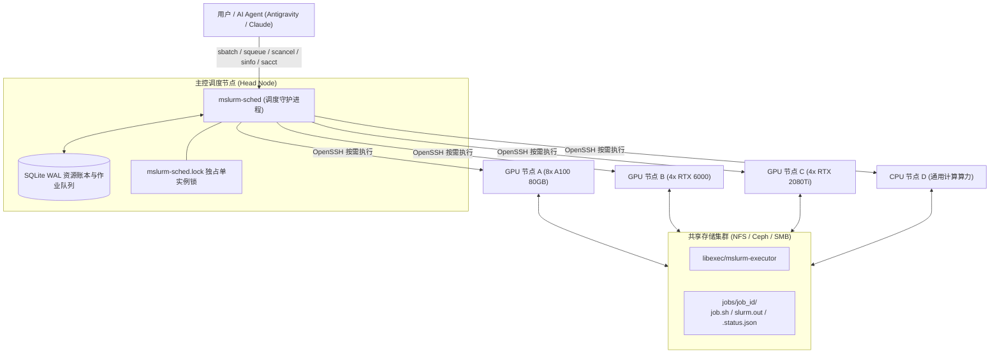

# Mini-Slurm 🚀

<p align="center">
  <strong>轻量级、免 Root、无常驻守护进程的分布式 CPU/GPU 作业调度系统</strong><br>
  <em>Lightweight, rootless, daemonless distributed job scheduler compatible with Slurm & native AI Agent skills.</em>
</p>

<p align="center">
  <a href="README.md">🇨🇳 简体中文</a> | <a href="README_EN.md">🇬🇧 English</a>
</p>

<p align="center">
  <a href="https://opensource.org/licenses/MIT"></a>
  <a href="https://www.python.org/"></a>
  <a href="#-核心特性-key-features"></a>
  <a href="#-作业提交与管理示例"></a>
  <a href="#-自动化测试与安全性验证-auditing--tests"></a>
</p>

---

**Mini-Slurm** 是一个专为中小规模多机 CPU / GPU 计算集群设计的轻量级、免 Root、免常驻节点守护进程的分布式作业调度系统。

它使用纯 **Python 标准库 + SQLite WAL + OpenSSH + 共享存储（NFS/Ceph/SMB）** 构建，提供与传统 Slurm 完全一致的交互体验（`sbatch`、`squeue`、`sinfo`、`scancel`、`sacct`），同时原生配备了供 AI 编程助手（如 Antigravity, Claude Code, Codex）直接调用的 **Agent Skill**。

---

## 🌟 核心特性 (Key Features)

- **纯标准库零外部依赖**：仅依赖 Python 3.8+ 标准库（`sqlite3`, `subprocess`, `fcntl`, `shlex`, `json` 等），无需安装任何第三方 pip 包。
- **计算节点零驻留守护进程**：计算节点无需运行 `slurmd`、Redis 或 RPC 服务，调度器通过原生 OpenSSH 按需拉起轻量级执行器（`mslurm-executor`），任务结束后自动退出。
- **Slurm 风格 CLI 兼容**：
  - `sbatch`：支持 `#SBATCH` 指令解析（`-c`, `--mem`, `--gres=gpu:N`, `-C/--constraint`, `-w/--nodelist`, `--time`, `-o`, `-e` 等）。
  - `squeue`：实时查看就绪、排队与运行中作业及其绑定的 GPU 卡号与节点。
  - `sinfo`：查看节点硬件状态（UP/DOWN/DRAIN）、CPU、内存与 GPU 实时分配率。
  - `scancel`：信号级作业取消，联动远端会话树递归杀灭。
  - `sacct`：作业历史耗时、退出码与状态溯源。
  - `mslurm`：一键管理调度服务（`start` / `stop` / `restart` / `status` / `logs`）。
- **多用户物理防踩踏与透明硬件感知 (Hardware Awareness & Anti-Collision)**：
  - 专为共享计算集群设计！调度器多线程并发探测远端 `nvidia-smi` 物理显存；
  - 外部人员直接裸跑或容器占用的卡自动标记为 `EXT_BUSY` 并主动规避，防止 OOM 冲突；
  - `sinfo` 支持概要显示 `GPUS(A/E/I/T)`（已分配 / 外部占用 / 完全空闲 / 总数）；
  - `sinfo -l` 详细透视每张卡的显存使用量与归属（区分 Slurm 作业与外部占用）；
  - 具备 **Fail-Closed** 安全机制：遥测丢失、超时或损坏时自动暂停新卡分配。
- **极度严苛的安全与并发设计（经过高强度混沌工程审计）**：
  - **时钟漂移免疫**：采用单调递增序列号（`heartbeat_seq`）与调度端本地单调时钟比对，彻底免疫节点间墙钟时差。
  - **网络异常资源冻结**：SSH 探测返回 255（网络断连/节点不可达）时，调度器严格保持 GPU 预留，经严格探针证实进程灭亡后才允许回收。
  - **Token 级进程探针**：基于 `/proc/*/cmdline` 的 NUL 字节严格分词匹配，杜绝自身匹配（Self-matching）与作业号前缀串扰（如取消 Job 1 误杀 Job 10/11）。
  - **会话与进程树彻底清理**：子进程前置注册信号处理器；退出与取消时递归扫描 `/proc` 清理整棵进程树与 `set -m` 作业控制子进程，杜绝后台孤儿进程。
  - **数据库强约束与平滑迁移**：内置 SQLite WAL 模式、排他文件锁与 `CHECK` 约束，杜绝负数资源请求与超分，并具备旧数据自动平滑迁移机制。
- **AI Agent 原生集成**：内置 `skills/mini-slurm/SKILL.md`，可无缝挂载至 Antigravity、Claude Code、Codex 等 AI 智能体，实现全自主实验派发与日志监控。

---

## 🏗️ 架构设计 (Architecture)



---

## 🚀 快速上手 (Quick Start)

### 1. 前置条件

1. **操作系统**：Linux（推荐 Ubuntu 20.04/22.04+ 或 Debian/CentOS/RHEL/Rocky Linux）。
2. **Python**：Python 3.8 或更高版本（主控节点与各计算节点均具备）。
3. **SSH 免密互信**：主控节点可通过 `ssh <node_target>` 免密登录所有计算节点。
4. **共享目录**：主控节点与计算节点挂载了相同的共享目录（如 `/mnt/share`）。

### 2. 目录结构配置

建议在主控节点或共享存储上解压 Mini-Slurm：

```bash
git clone https://github.com/TingheZhang/Mini-slrum.git /mnt/share/mini-slurm
cd /mnt/share/mini-slurm
```

将可执行命令加入环境变量（例如在 `~/.bashrc` 中添加）：
```bash
export PATH="/mnt/share/mini-slurm/bin:$PATH"
```

### 3. 配置集群节点 (`etc/nodes.json`)

复制模板文件并按实际集群硬件配置：
```bash
cp etc/nodes.json.example etc/nodes.json
vim etc/nodes.json
```

配置示例：
```json
{
  "nodes": {
    "gpu-node01": {
      "ssh_target": "node01",
      "python_bin": "/opt/conda/bin/python",
      "cpus": 80,
      "mem_mb": 160000,
      "gpus": [
        {"id": 0, "model": "a100", "aliases": ["a100", "a800", "a100-80gb"]},
        {"id": 1, "model": "a100", "aliases": ["a100", "a800", "a100-80gb"]}
      ],
      "enabled": true
    },
    "gpu-node02": {
      "ssh_target": "node02",
      "python_bin": "/usr/bin/python3",
      "cpus": 24,
      "mem_mb": 110000,
      "gpus": [
        {"id": 0, "model": "rtx6000", "aliases": ["rtx6000", "blackwell"]}
      ],
      "enabled": true
    },
    "cpu-node01": {
      "ssh_target": "node03",
      "python_bin": "/usr/bin/python3",
      "cpus": 36,
      "mem_mb": 120000,
      "gpus": [],
      "enabled": true
    }
  }
}
```

> [!TIP]
> 如果计算节点运行在 **Docker 容器** 中，请将 `cpus` 和 `mem_mb` 设置为容器 cgroups 的实际硬限额（可通过 `/sys/fs/cgroup/cpu.max` 与 `/sys/fs/cgroup/memory.max` 查看），以避免超出配额导致被宿主机 OOM-Kill。

### 4. 启动调度服务

```bash
# 启动调度守护进程
mslurm start

# 检查服务状态
mslurm status

# 查看集群状态
sinfo
```

输出示例：
```text
NODELIST     STATE    CPUS(A/I/T)    MEM(A/T MB)        GPUS(A/E/I/T)    GPU_MODELS
gpu-node01   UP       0/80/80        0/160000           0/0/8/8          a100
gpu-node02   UP       0/24/24        0/110000           0/1/3/4          rtx6000
gpu-node03   UP       0/10/10        0/80000            0/0/4/4          rtx2080ti
cpu-node01   UP       0/36/36        0/120000           0/0/0/0          none
```

查看物理显存实时遥测与外部占用：
```bash
sinfo -l
```

---

## 📝 作业提交与管理示例

### 1. 提交 GPU 作业 (`run_gpu.sbatch`)

```bash
#!/bin/bash
#SBATCH --job-name=train_model
#SBATCH --cpus-per-task=4
#SBATCH --mem=16000
#SBATCH --gres=gpu:1
#SBATCH -C a100
#SBATCH --time=01:00:00
#SBATCH --output=/mnt/share/logs/%j.out
#SBATCH --error=/mnt/share/logs/%j.err

echo "Running on node: $(hostname)"
echo "Assigned GPU: $CUDA_VISIBLE_DEVICES"
python3 train.py
```

提交与查询：
```bash
$ sbatch run_gpu.sbatch
Submitted batch job 1

$ squeue
JOBID    NAME             USER       ST         TIME       NODELIST(RESOURCES)     
1        train_model      alice      RUNNING    00:05      gpu-node01:gpu[0]
```

### 2. 提交纯 CPU 作业（支持节点钉死）

```bash
#!/bin/bash
#SBATCH --job-name=data_prep
#SBATCH --cpus-per-task=8
#SBATCH --mem=32000
#SBATCH -w cpu-node01
#SBATCH --time=00:30:00

python3 preprocess.py
```

### 3. 取消作业

```bash
$ scancel 1
Cancellation requested for job 1 on gpu-node01
```
Mini-Slurm 会立即向远端执行器注入取消信号，并在数秒内完成整棵进程树递归杀灭与 GPU/CPU 账本原子回收。

### 4. 查看历史与计费

```bash
$ sacct
JobID    JobName          Node        State        ExitCode   Elapsed    SubmitTime          
1        train_model      gpu-node01  COMPLETED    0          00:15      2026-09-18 10:00:00 
```

---

## 🤖 AI Agent Skill 原生集成

Mini-Slurm 仓库自带 `skills/mini-slurm/SKILL.md`，专门为各种主流 AI 智能体（LLM Coding Agents）设计：

### 如何挂载使用？
- **Antigravity**：将 `skills/mini-slurm` 放置在 `.gemini/antigravity/skills/` 或工作区 skills 目录下即可自动识别。
- **Claude Code / Codex**：将 `skills/mini-slurm/SKILL.md` 内容添加至系统 Prompt 或作为上下文参考文件。

智能体在拥有该 Skill 后，可全自主闭环：
1. 提交前自动探测集群卡闲置情况（`sinfo`）；
2. 根据训练脚本显存需求自动选择硬件约束（如 `-C a100` 或 `-w node`）；
3. 提交任务并记录 Job ID；
4. 周期性轮询与检查输出日志；
5. 在训练异常中断时触发自动诊断与重试。

---

## 🛡️ 自动化测试与安全性验证 (Auditing & Tests)

Mini-Slurm 内置了针对分布式边界条件的完备对抗式测试套件（位于 `tests/` 目录）：

```bash
# 1. 核心安全性与并发测试（并发原子抢占、幂等结算、负资源拒绝、指令容错）
python3 -B tests/test_safety.py

# 2. 故障容错与边界测试（网络 255 断连保护、时钟漂移单调比对、进程树彻底杀灭、CHECK 约束）
python3 -B tests/test_reaudit.py

# 3. 探针精确度与状态恢复测试（Token 级 /proc 探针防自匹配、前缀隔离、早期 SIGTERM 防孤儿、旧数据迁移）
python3 -B tests/test_probe_and_kill.py
python3 -B tests/test_t3_t4.py

# 4. 物理显存感知与避让测试（外部用户占用识别、显存穿透探测、动态释放回收）
python3 -B tests/test_hardware_awareness.py

# 5. 约束仲裁与拓扑校验测试（-C 与 --gres 冲突仲裁、遥测 Fail-Closed、节点白名单强校验）
python3 -B tests/test_nodelist_constraint.py
```

---

## 📂 代码目录概览

```text
mini-slurm/
├── bin/                       # 用户 CLI 命令
│   ├── sbatch                 # 提交批处理作业
│   ├── squeue                 # 查询排队与运行状态
│   ├── sinfo                  # 集群与显卡硬件信息 (支持 -l 物理感知)
│   ├── scancel                # 作业取消与进程树清理
│   ├── sacct                  # 作业历史与退出状态审计
│   └── mslurm                 # 守护进程管理脚本 (start/stop/restart/status/logs)
├── sbin/                      # 系统守护进程
│   └── mslurm-sched           # 核心调度器 (协调、对账、探针、资源分配)
├── libexec/                   # 远端计算节点执行器
│   └── mslurm-executor        # 任务执行器 (环境注入、心跳、进程组追踪、超时与取消治理)
├── lib/                       # Python 核心底层库
│   ├── mslurm_db.py           # SQLite WAL 存储引擎 (原子性账本、CHECK 约束、平滑迁移)
│   └── mslurm_parser.py       # SBATCH 语法解析器与参数规范化
├── etc/                       # 配置文件
│   └── nodes.json.example     # 节点与显卡硬件拓扑配置模板
├── examples/                  # 典型作业脚本示例
│   ├── test_a100.sbatch       # A100 GPU 测试作业
│   ├── test_rtx6000.sbatch    # RTX 6000 测试作业
│   ├── test_2080ti.sbatch     # RTX 2080Ti 测试作业
│   ├── test_cpu.sbatch        # 纯 CPU 测试作业
│   └── test_cancel.sbatch     # 作业取消测试脚本
├── tests/                     # 自动化安全与混沌测试套件
│   ├── test_safety.py         # 核心并发与幂等安全测试
│   ├── test_reaudit.py        # 网络断连与单调心跳测试
│   ├── test_probe_and_kill.py # 进程参数数组精确匹配测试
│   ├── test_t3_t4.py          # 极速信号处理与脏数据热迁移测试
│   ├── test_hardware_awareness.py  # 物理 GPU 感知与防碰撞测试
│   └── test_nodelist_constraint.py # 约束冲突仲裁与节点校验测试
├── skills/                    # AI Agent 智能体技能库
│   └── mini-slurm/
│       └── SKILL.md           # Mini-Slurm Agent Skill 规范文件
├── .gitignore
├── LICENSE                    # MIT 开源协议
├── README.md                  # 中文说明文档
└── README_EN.md               # 英文说明文档 (English Documentation)
```

---

## 📄 License

Mini-Slurm 采用 [MIT License](LICENSE) 开源协议。欢迎提交 Issue 与 Pull Request！
